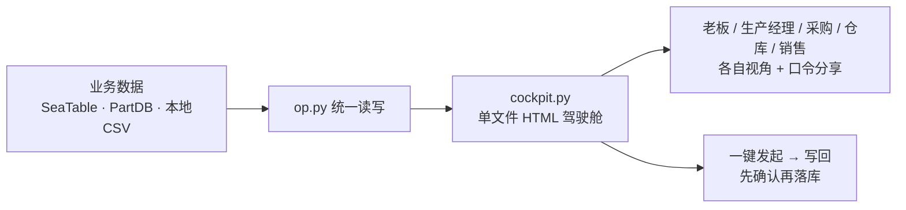

# 生产交付协同助手

**用大白话说：你在对话里说「帮我建个生产计划，4G 小卡 100 台，交期 30 天」，它就把数据落库；
然后一句「生成驾驶舱」，给你一个网页——老板、生产经理、采购、仓库、销售各看各的那一屏。**

不需要 SeaTable 账号，不需要 PartDB，**下载完直接能跑**（数据存本地 CSV）。


<sub>↑ 生产经理视角首屏实拍。数据为**虚构演示数据**。首屏只放 3-4 块：「今天要处理」置顶 → 4 张核心指标 → 行动建议，其余分析收在「更多分析」里，点开才展开。</sub>

**想直接点开玩玩？** → 🖥️ **[交互式使用指南（在线，无需安装）](https://darling5.github.io/seatable-production/usage-guide.html)**

<details>
<summary>🎬 展开看 60 秒演示视频</summary>

<video src="https://darling5.github.io/seatable-production/demo.mp4" controls muted loop playsinline width="100%" style="max-width:960px;border-radius:12px"></video>

视频与截图均使用**完全虚构的演示数据**，不含任何真实业务信息与口令。
</details>

---

## 30 秒装好

在 WorkBuddy 里 **「我的项目 → 新建项目」**，项目来源粘贴这个链接：

```
https://github.com/Darling5/seatable-production
```

创建后会自动带上 `seatable-production` 技能和「生产驾驶舱」专家。然后直接说话：

| 你说 | 它做 |
|---|---|
| 生成演示版驾驶舱 | 用内置示例数据出一张完整网页，立刻看到效果 |
| 帮我建个生产计划：4G 小卡，100 台，交期 30 天 | 整理成待写入数据 → **等你确认** → 落库 |
| 这批货缺什么料 | 拉 BOM 比库存，列出缺料清单 |
| 出一张发货清单 | 生成清单并可导出 Excel |

> ⚠️ **写入前一定先问你**：任何增删改都会把待写入数据**完整摊开给你看**，你点头才落库。
> 网页上的「一键发起」也只是拉起 WorkBuddy 并预填任务，**不会自动写库**。这是刻意设计，不是 bug。

<details>
<summary>其他安装方式（clone / ZIP）</summary>

```bash
# clone 到技能目录，可随 git 更新
git clone https://github.com/Darling5/seatable-production.git \
  ~/.workbuddy/skills/seatable-production        # Windows Git Bash 用 "$HOME/..."
```

或在 GitHub 点 `Code → Download ZIP`，解压后把 `seatable-production/` 放进 `~/.workbuddy/skills/`。

装好后**重启 WorkBuddy**。想跑引导式配置向导：

```bash
cd ~/.workbuddy/skills/seatable-production
python setup.py            # 交互式：选 本地 / SeaTable
python setup.py --local    # 或直接零配置
```
</details>

---

## 它到底解决什么问题

小批量电子制造的活儿，数据散在一堆地方：项目在 SeaTable、物料在 PartDB、发货记录在某个 Excel 里。
每个人都要问别人「那个单子到哪一步了」。

这个技能做两件事：

1. **统一读写**——`op.py` 一个入口管 14 张业务表（项目 / 生产计划 / 采购 / 发货 / 维修…），不管后端是本地 CSV 还是 SeaTable 云。
2. **按角色出网页**——`cockpit.py` 把数据算成 KPI、甘特图、缺料预警，生成**单文件 HTML**，5 个角色各一套视图，可设口令分享给同事。



---

## 三种用法，按需选

**① 零配置（默认）** — 数据存 `data/` 下的 CSV，Excel 直接打开：

```bash
python3 op.py append 生产计划 '{"生产产品":"4G小卡","数量":100,"关联项目":"演示项目A"}'
python3 op.py list 生产计划
python3 op.py export-excel 生产数据.xlsx
python3 cockpit.py                      # 生成驾驶舱网页
```

**② 接你自己的 SeaTable** — `cp config.yaml.example config.yaml`，填上：

```yaml
backend: seatable
seatable:
  api_token: "你的Token"
  base_uuid: "你的BaseUUID"
```

命令一行都不用改。想退回本地，`backend` 改回 `local`。

**③ 接 PartDB 做缺料检查**（有实例才需要）：

```yaml
partdb:
  enabled: true
  url: "http://你的PartDB:端口/api"
  token: "你的PartDBToken"
```

```bash
python3 op.py partdb-shortage 22 100       # 生产100套→缺什么料
```

没配 PartDB 时缺料场景会提示「未配置，跳过」，不报错。

---

## 深入阅读

- 📖 **[使用手册](docs/manual.md)** —— 14 张表怎么用、阶段 → 该写哪张表的对照、甘特图怎么读、格式铁律
- 🖥️ **[交互式使用指南（HTML）](https://darling5.github.io/seatable-production/usage-guide.html)** —— 能点的角色视图 / 深链发起 / 夜间模式演示
- 📁 **[导入为项目](docs/import-as-project.md)** —— 团队共享同一套版本的做法

---

## 分享与安全

技能里**不含任何凭证**——`config.yaml` 在 `.gitignore` 里，`data/` 也是。
打包整个文件夹发给同事，对方零配置即用，或填自己的配置。

驾驶舱网页支持按角色设口令分享（`口令管理`），敏感财务数据只有老板视图可见。

> 分享前请注意：驾驶舱网页里嵌的是**你的真实业务数据**。要公开演示请先用演示数据重新生成。

<details>
<summary>目录结构</summary>

```
seatable-production/
├── SKILL.md              # 领域知识（流程/表规则/格式/分析），不含任何凭证
├── config.yaml.example   # 配置模板（复制为 config.yaml 后填写）
├── op.py                 # 统一数据操作 CLI（模型与用户都只调它）
├── cockpit.py            # 驾驶舱网页生成器（单文件 HTML）
├── adapters/             # 后端适配器（可插拔）
│   ├── local.py          #   本地 CSV（默认，零依赖）
│   ├── seatable.py       #   SeaTable（配置驱动）
│   ├── partdb.py         #   PartDB（可选）
│   └── schema.py         #   14 表结构 + 15 条语义关联 + 默认值
├── references/           # 长文档（业务流程 / 分析公式）
├── data/                 # 本地数据（自动生成，已 gitignore）
└── docs/                 # 手册、配图、在线指南
```
</details>

---

<sub>本文档由 **混元3**（腾讯混元大模型）辅助撰写。</sub>
