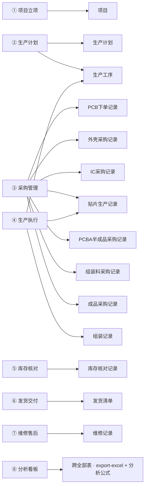
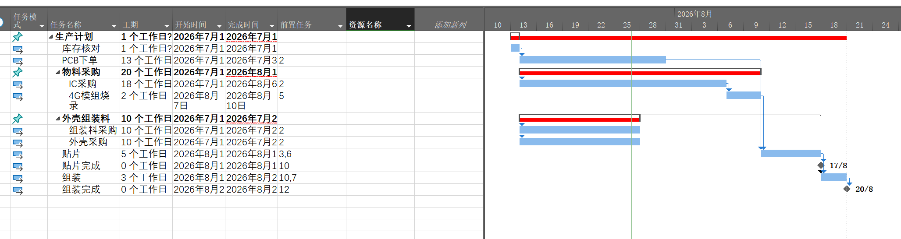
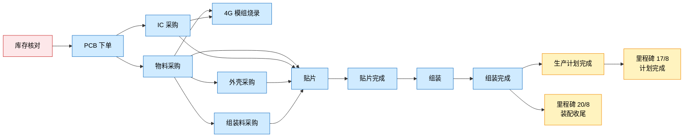

# 生产交付协同助手（解耦版）

一套「生产立项 → 计划 → 采购 → 执行 → 库存 → 发货 → 维修 → 分析」全流程的自然语言协同技能。
**最大特点：开箱零配置，任何人都能用——不需要 SeaTable 账号，也不需要 PartDB。**

> 本文档由 **混元3**（腾讯混元大模型）辅助撰写。

---

## 0. 从 GitHub 安装到 WorkBuddy

本技能是 [WorkBuddy](https://www.codebuddy.cn) 的技能包，两种装法：

**方式 A：clone 到技能目录（推荐，可随 git 更新）**

```bash
# Windows (Git Bash)
git clone https://github.com/Darling5/seatable-production.git \
  "$HOME/.workbuddy/skills/seatable-production"

# macOS / Linux
git clone https://github.com/Darling5/seatable-production.git \
  ~/.workbuddy/skills/seatable-production
```

**方式 B：下载 ZIP**
在 GitHub 页面点 `Code → Download ZIP`，解压后把 `seatable-production/` 文件夹
放到 `~/.workbuddy/skills/` 下即可。

> 装好后**重启 WorkBuddy**，对话里说「帮我建个生产计划」「出一张发货清单」就会触发。
> 默认零配置即用（本地 CSV 存储）；想接自己的 SeaTable / PartDB，见第 3、4 节。

**首次运行建议先跑引导式安装向导**（会问你要用哪种后端、有没有 token，避免手动改配置）：

```bash
cd ~/.workbuddy/skills/seatable-production
python setup.py            # 交互式：选 本地 / SeaTable / MySQL
# 或 python setup.py --local   # 直接零配置
```

---

## 0.1 为什么选 WorkBuddy & 团队怎么共享

**为什么是 WorkBuddy**：它的技能体系天然分两级——**用户级**（`~/.workbuddy/skills/`，个人私有）和**项目级**（`<项目>/.workbuddy/skills/`，团队共享）。这正好覆盖两种场景：个人想用就用，团队要统一版本也能统一。对生产交付这种「多人协作同一套数据/表规则」的活儿，这点很关键。

**团队落地有两种方式，区别在「版本是否统一」：**

| | 项目级技能（推荐团队） | 给每人发 skill 包（用户级） |
|---|---|---|
| 放哪 | `<项目>/.workbuddy/skills/seatable-production/` | 每人 `~/.workbuddy/skills/`（各自解压 ZIP） |
| 谁能用 | 该项目**所有成员自动共享** | 只有拿到包的那个人 |
| 版本一致性 | ✅ 维护者升级一次，全员即时生效，不会漂移 | ❌ 每人一份独立副本，你升 v2 别人还是 v1 |
| 适合 | 生产经理 + 采购 + 外协厂 + 仓库 + 项目方 协作同一套生产数据 | 个人零散使用、不依赖团队 |

**推荐做法**：想让「一个项目/公司多人用同一版本」，就把技能放在**项目级**目录——一人维护、全员同版本；
只是自己或个人偶尔用，放用户级即可。两种方式的数据都各自存本地 CSV，互不干扰。

> 一句话：给每人发 ZIP 包能用，但**不利于大家保持同一版本**；放项目级，才是「一个公司多人共用一套」的正确姿势。

---

## 0.2 表格怎么用（op.py 操作 14 张表）

所有对表的操作都走统一入口 `op.py`，**不用关心底层是本地 CSV 还是 SeaTable**。
通用格式：`python3 op.py <子命令> <表名> [参数]`（Windows 用 `py op.py` 或 `python op.py`；`<表名>` 用中文，如 `生产计划`）。

### 14 张表一览（按业务主从关系）
1. 项目
2. 生产计划
3. 发货清单
4. 维修记录
5. 生产工序
6. 库存核对记录
7. PCB下单记录
8. 外壳采购记录
9. IC采购记录
10. 贴片生产记录
11. PCBA半成品采购记录
12. 组装料采购记录
13. 组装记录
14. 成品采购记录

> 表名就是 `op.py` 里要填的 `table` 参数，中文、不带空格。

### 核心命令速查
| 命令 | 作用 | 示例 |
|---|---|---|
| `list <表>` | 列出整张表 | `python3 op.py list 生产计划` |
| `query <表> --where 列=值` | 按条件筛选 | `python3 op.py query 生产计划 --where 状态=进行中` |
| `append <表> '<json>'` | 新增一行 | `python3 op.py append 生产计划 '{"生产产品":"4G小卡","数量":100}'` |
| `update <表> <行ID> '<json>'` | 改某行 | `python3 op.py update 生产计划 row_3 '{"状态":"已完成"}'` |
| `delete <表> <行ID...>` | 删行（可多行） | `python3 op.py delete 生产计划 row_3` |
| `link <表> <其他表> <行ID> <其他行ID...>` | 建双向关联 | `python3 op.py link 生产计划 项目 row_3 row_1` |
| `linked <表> <行ID>` | 看某行关联了谁 | `python3 op.py linked 生产计划 row_3` |
| `meta <表>` | 看表结构/列 | `python3 op.py meta 生产计划` |
| `export-excel [文件]` | 全部表导出 Excel | `python3 op.py export-excel 生产数据.xlsx` |

### 一条完整工作流示例
```bash
# 1) 立项：建项目（产品需求必须用 Markdown 表格）
python3 op.py append 项目 '{"项目":"客户A-4G小卡","产品需求":"| 产品名称 | 型号 | 数量 | 单价 | 金额 |\n| ---- | ---- | ---- | ---- | ---- |\n| 4G小卡 | V4.0 | 100 | 200 | 20000 |","合同总价":20000}'

# 2) 做生产计划（没填的字段会自动套默认值：状态=计划中/阶段=库存核对/立项日期=今天）
python3 op.py append 生产计划 '{"生产产品":"4G小卡","数量":100,"关联项目":"客户A-4G小卡"}'

# 3) 和生产计划双向关联项目（铁律：主数据写入后必须立即建关联）
python3 op.py link 生产计划 项目 <生产计划行ID> <项目行ID>

# 4) 查询 + 导出给同事用 Excel 看
python3 op.py list 生产计划
python3 op.py export-excel 生产数据.xlsx
```

### 两个格式铁律（务必遵守）
- **产品需求**（项目表）：必须用 Markdown 表格，列头 `产品名称 / 型号 / 数量 / 单价 / 金额`，不能写纯文本。
- **发货内容**（发货清单表）：必须用 Markdown 表格，列头 `产品名称 / 固件版本 / 产品型号 / 数量 / ID号 / SIM卡号`；`ID号` ≤3 个可逗号分隔，>3 个必须每行一个。

### 默认值会自动套用（写入时未提供的字段由适配器补）
| 表 | 自动默认值 |
|---|---|
| 生产计划 | `状态=计划中`、`阶段=库存核对`、`立项日期=今天` |
| 项目 | `状态=计划中` |
| 外壳采购记录 | `供应商=华宸振凯`、`采购时间=今天` |
| IC采购记录 | `状态=未下单` |
| 贴片生产记录 | `状态=待送料` |
| PCBA半成品采购记录 | `供应商=空循环`、`状态=未下单` |
| 组装料采购记录 | `状态=谈判中` |
| 组装记录 | `组装厂=禾平` |
| 成品采购记录 | `状态=谈判中`、`下单时间=今天` |

> 数值类字段（数量/价格/交期）当时没有就先空着（标记 📥 后补），不会报错；SeaTable 模式下 single/multiple-select 列会显示中文标签。

---

## 0.3 阶段 → 用哪些表（对照图）



| 阶段 | 主要用表 | 关键内容 |
|---|---|---|
| ① 项目立项 | 项目 | 产品需求(MD 表) / 合同 / 应收款提醒 |
| ② 生产计划 | 生产计划、生产工序 | 拆工序、算交期倒计时 |
| ③ 采购管理 | PCB下单 / 外壳采购 / IC采购 / 贴片生产 / PCBA半成品采购 / 组装料采购 / 成品采购 | 7 类采购、交期跟踪、逾期预警 |
| ④ 生产执行 | 生产工序、贴片生产记录、组装记录 | 进度、良品率、交期风险 |
| ⑤ 库存核对 | 库存核对记录 | 缺料预警、盘点差异 |
| ⑥ 发货交付 | 发货清单 | 出库内容(MD 表)、快递、签收 |
| ⑦ 维修售后 | 维修记录 | 返修、供应商追责 |
| ⑧ 分析看板 | （跨全部表） | `op.py export-excel` + 分析公式 |

> 所有表都通过 `op.py` 操作（见 0.2 节）；表与表之间的关联由 `link` 命令建立双向链路。

---

## 0.4 生产计划甘特图（来自 SeaTable）

下面这张图来自 SeaTable 端生产计划模块的甘特图视图，对应 8 大阶段中**② 计划 / ③ 采购 / ④ 执行**三段的实际排程。把它放进来是因为它把"表与表之间的时间依赖"画得很清楚——光看表数据很难一眼看出谁先谁后。

### 甘特图全貌



### 任务清单与排程（从图中读出）

| 任务 | 所属阶段 | 工期 | 开始 | 完成 | 前置任务 |
|---|---|---:|---|---|---|
| 库存核对 | ① 立项 | 1 个工作日 | 2026-07-01 | 2026-07-02 | — |
| PCB 下单 | ③ 采购 | 13 个工作日 | 2026-07-01 | 2026-07-20 | 库存核对 |
| 物料采购 | ③ 采购 | 20 个工作日 | 2026-07-01 | 2026-08-01 | PCB 下单 |
| IC 采购 | ③ 采购 | 18 个工作日 | 2026-07-01 | 2026-08-02 | PCB 下单 |
| 4G 模组烧录 | ④ 执行 | 2 个工作日（含 7/7–7/10） | 2026-08-01 | 2026-08-05 | 物料采购、IC 采购 |
| 外壳采购 | ③ 采购 | 10 个工作日 | 2026-07-01 | 2026-07-15 | — |
| 组装料采购 | ③ 采购 | 10 个工作日 | 2026-07-01 | 2026-07-15 | — |
| 贴片 | ④ 执行 | 5 个工作日 | 2026-07-01 | 2026-08-13 | 物料采购、IC 采购、外壳组装料 |
| 贴片完成 | ④ 执行 | 0 个工作日 | 2026-08-01 | 2026-08-11 | 贴片 |
| 组装 | ④ 执行 | 3 个工作日 | 2026-07-01 | 2026-08-21 | 贴片完成 |
| 组装完成 | ④ 执行 | 0 个工作日 | 2026-08-20 | 2026-08-21 | 组装 |
| 生产计划（汇总） | — | 跨整个周期 | 2026-07-01 | 2026-07-18 | 所有采购 |

### 任务依赖关系（4 张 SeaTable 表的串联链路）



### 两个里程碑

- 📍 **17/8（2026-08-17）** = 生产计划整体完成节点
- 📍 **20/8（2026-08-20）** = 装配收尾节点（`组装完成` 后一天）

### 这张图对本技能的意义

- **「关联」不是装饰，是排程的依据**：上面每条 `--> ` 在数据库里都对应一次 `op.py link`；没有 link，时间先后排不出来。
- **「在制品看板」的真实样子**：8 月初是这张图最紧张的时段——`贴片 / 4G 模组烧录 / 外壳 / 组装料` 四条线并发，对应本技能 §9「在制品看板」按剩余时间升序排的逻辑。
- **跨表依赖可视化**：库存核对 → PCB → 物料 → 贴片 → 组装，正是从 `项目` 一路 `op.py link` 到 `组装记录` 的完整链路；按依赖建链是铁律（§1）。

---

## 1. 它和旧版有什么不同

| | 旧版 | 本解耦版 |
|---|--------|-----------|
| 存储 | 写死你的 SeaTable Base + PartDB 内网 | **默认本地 CSV/Excel，零配置** |
| 凭证 | `API Token`/`UUID`/内网 IP **硬编码**在技能里 | **全部移出，改由 `config.yaml` 配置** |
| 门槛 | 必须有 SeaTable+PartDB 才能跑 | **离线就能用，谁都能装** |
| 切换 | 无法切换 | `config.yaml` 里 `backend: local/seatable` 一键切 |

> 旧版把你的私人 token 和公司内部地址写死在技能文件里，原样发出去会**泄露凭证**并**绑死所有人**。
> 本版彻底消除了这个问题，可以放心分发给同事/客户。

---

## 2. 零配置直接用（推荐）

把整个 `seatable-production/` 文件夹给对方即可。对方无需任何账号：

```bash
cd seatable-production
python3 op.py append 项目 '{"项目":"演示项目A","产品需求":"| 产品名称 | 型号 | 数量 | 单价 | 金额 |\n| ---- | ---- | ---- | ---- | ---- |\n| 4G小卡 | V4.0 | 100 | 200 | 20000 |"}'
python3 op.py append 生产计划 '{"生产产品":"4G小卡","数量":100,"关联项目":"演示项目A"}'
python3 op.py list 生产计划
python3 op.py export-excel 生产数据.xlsx   # 导出 Excel 给人看
```

数据自动落在 `data/` 目录（每张表一个 `.csv`）。用 Excel/WPS 直接打开查看。

---

## 3. 进阶：接入你自己的 SeaTable（可选）

只有当你**自己**有个 SeaTable Base 想接着用时才需要：

1. `cp config.yaml.example config.yaml`
2. 编辑 `config.yaml`：
   ```yaml
   backend: seatable
   seatable:
     api_token: "你的Token"
     base_uuid: "你的BaseUUID"
   ```
3. 其余操作完全不变（还是 `op.py ...`），数据就写到你自己的 Base 了。
4. 想退回本地？把 `backend` 改回 `local` 即可。

---

## 4. 进阶：接入 PartDB 做缺料检查（可选）

有 PartDB 实例才需要，在 `config.yaml` 里：

```yaml
partdb:
  enabled: true
  url: "http://你的PartDB:端口/api"
  token: "你的PartDBToken"
```

然后：
```bash
python3 op.py partdb-search 电容 10        # 查物料
python3 op.py partdb-shortage 22 100       # 生产100套→缺什么料
```
没开 PartDB 时，涉及缺料的场景会自动提示「未配置，跳过」，不会报错。

---

## 5. 分享给别人

直接把 `seatable-production/` 整个文件夹打包（zip）发走就行。**技能里不含任何凭证**，
对方拿到后按第 2 节零配置即用，或按第 3/4 节填自己的配置。

---

## 6. 目录结构

```
seatable-production/
├── SKILL.md              # 领域知识（流程/表规则/格式/分析），不含任何凭证
├── config.yaml.example   # 配置模板（复制为 config.yaml 后填写）
├── op.py                # 统一数据操作 CLI（模型与用户都只调它）
├── adapters/            # 后端适配器（可插拔）
│   ├── base.py         # 抽象接口
│   ├── local.py        # 本地 CSV（默认，零依赖）
│   ├── seatable.py     # SeaTable（配置驱动）
│   ├── partdb.py       # PartDB（可选）
│   ├── factory.py      # 适配器工厂（按 config 选后端）
│   └── schema.py       # 14 表结构 + 15 条语义关联 + 默认值
├── references/          # 长文档（业务流程 / 分析公式）
├── scripts/             # 配置驱动的辅助脚本
├── data/               # 本地数据（自动生成，可加入 .gitignore）
└── docs/                # 配图、示例（甘特图等可视化素材）
```
