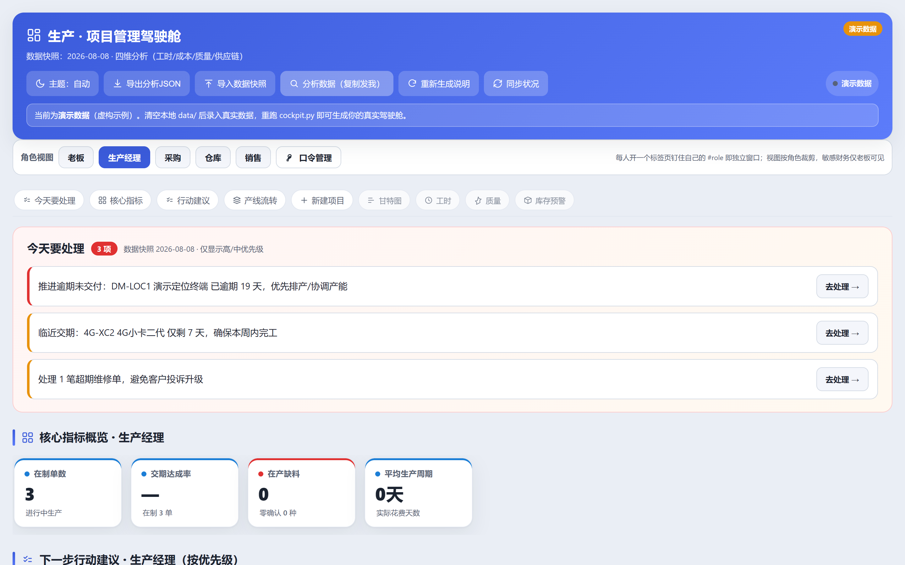
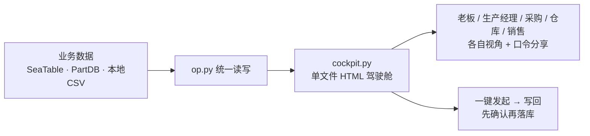

# 生产交付协同助手

**用大白话说：这是生产经理的“第二大脑”。你在对话里说「帮我建个生产计划，4G 小卡 100 台，交期 30 天」，它会在确认后把数据落库并生成分角色驾驶舱；把采购合同交给它，还能自动匹配标准 BOM、核对库存，经人工审核后生成可发供应商的正式采购订单。**

业务台账不需要 SeaTable 账号，下载后即可用本地 CSV；采购库存可选一键部署的 PartDB，也可接客户已有 ERP 的 API、MCP 或 Excel/CSV 导出。



<sub>↑ 生产经理视角首屏实拍。数据为**虚构演示数据**。首屏只放 3-4 块：「今天要处理」置顶 → 4 张核心指标 → 行动建议，其余分析收在「更多分析」里，点开才展开。</sub>

**想直接点开玩玩？** → **[交互式使用指南（在线，无需安装）](https://darling5.github.io/seatable-production/usage-guide.html)**

---

## 30 秒装好

在 WorkBuddy 里 **「我的项目 → 新建项目」**，项目来源粘贴这个链接：

```
https://github.com/Darling5/seatable-production
```

创建后会自动带上 `seatable-production` 技能和「生产驾驶舱」专家。然后直接说话：

| 你说 | 它做 |
|---|---|
| 生成演示版驾驶舱 | 用内置示例数据出一张完整网页，立刻看到效果 |
| 帮我建个生产计划：4G 小卡，100 台，交期 30 天 | 整理成待写入数据 → **等你确认** → 落库 |
| 这批货缺什么料 | 拉 BOM 比库存，列出缺料清单 |
| 出一张发货清单 | 生成清单并可导出 Excel |

> ⚠️ **写入前一定先问你**：任何增删改都会把待写入数据**完整摊开给你看**，你点头才落库。
> 网页上的「一键发起」也只是拉起 WorkBuddy 并预填任务，**不会自动写库**。这是刻意设计，不是 bug。

<details>
<summary>其他安装方式（clone / ZIP）</summary>

```bash
# clone 到技能目录，可随 git 更新
git clone https://github.com/Darling5/seatable-production.git \
  ~/.workbuddy/skills/seatable-production        # Windows Git Bash 用 "$HOME/..."
```

或在 GitHub 点 `Code → Download ZIP`，解压后把 `seatable-production/` 放进 `~/.workbuddy/skills/`。

装好后**重启 WorkBuddy**。想跑引导式配置向导：

```bash
cd ~/.workbuddy/skills/seatable-production
python setup.py            # 交互式：选 本地 / SeaTable
python setup.py --local    # 或直接零配置
```
</details>

---

## 它到底解决什么问题

小批量电子制造的活儿，数据散在一堆地方：项目在 SeaTable、物料在 PartDB、发货记录在某个 Excel 里。
每个人都要问别人「那个单子到哪一步了」。

这个技能做三件事：

1. **统一读写**——`op.py` 一个入口管业务表，不管后端是本地 CSV 还是 SeaTable 云。
2. **按角色出网页**——`cockpit.py` 把数据算成 KPI、甘特图、缺料预警，生成**单文件 HTML**，5 个角色各一套视图，可设口令分享给同事。
3. **采购合同变采购订单**——合同解析 → 标准 BOM 扩量 → PartDB/ERP API/MCP/文件库存源 → 人工审核 → 供应商分组 → 正式采购订单 PDF。
4. **微信消息变业务情报**——接入 `win-wechat-summary` 生成的本地 `merge_all.db`，按监控群拉取新消息，提取交期、价格、停产、催货、进度和库存事件，确认后才写回业务表。
5. **物料行情可追踪**——从采购记录生成物料监控清单，记录渠道价快照、采购价偏差、环比涨跌和 NRND/EOL 生命周期状态，在驾驶舱里集中显示趋势与告警。



### 微信情报与行情监控

新增能力采用“本地专用数据 + 业务表确认写入”的方式，避免每日同步时覆盖监控信息：

```text
win-wechat-summary / PyWxDump
        ↓ 只读本地微信数据库
merge_all.db → wechat_intake.py pull
        ↓
微信事件.csv（待确认） → 用户确认 → SeaTable 业务表 + 工作日志

采购记录 → market.py watchlist
        ↓
物料监控清单.csv + 物料行情记录.csv
        ↓
价格涨跌 / NRND / EOL → 驾驶舱告警
```

> 个人微信没有开放读取 API。本项目不会连接微信服务器；`win-wechat-summary` 需要用户在 Windows 本机完成微信数据库同步。涉及交期、价格、数量、金额或采购下单的微信事件，默认只进入“待确认”，不会自动改业务表。

---

## 微信情报反哺

先安装并运行 [win-wechat-summary](https://github.com/yanyan1115/win-wechat-summary)，让它在本机微信登录状态下生成 `merge_all.db`。然后配置 `config.yaml`：

```yaml
wechat:
  enabled: true
  db_path: "C:/Users/你的用户名/.../merge_all.db"
  watch_groups: [供应商群, 项目群]
  max_hours: 48
```

检查数据库并列出群：

```bash
python wechat_intake.py doctor
python wechat_intake.py groups
python wechat_intake.py pull
```

`pull` 使用 `data/wechat_intake/bookmark.json` 按群记录读取位置，重复执行不会反复拉取同一批消息。AI 提取事件后登记为待确认：

```bash
python wechat_intake.py add-event \
  --group 供应商群 --sender 供应商A \
  --category 价格变动 \
  --text "FR8018HD 下周报价可能上涨 12%" \
  --intent '{"op":"log","table":"工作日志","data":{"原话":"FR8018HD 下周报价可能上涨 12%"}}'

python wechat_intake.py list --status 待确认
python wechat_intake.py approve WX20260821-001
python wechat_intake.py ignore WX20260821-002
```

可识别分类：交期变更、价格变动、停产通知、催货、进度、库存、其他。驾驶舱的「微信情报台」展示原文、来源群、分类、待确认状态和最终写入结果。

## 物料行情监控

从 IC、组装料、成品、外壳和 PCBA 采购记录提取型号与历史采购价，生成监控清单：

```bash
python market.py watchlist
python market.py watchlist --refresh
python market.py add FR8018HD --price 3.10 --category IC
```

每周检查后写入行情快照；没有可靠价格或生命周期来源时填“未知”，不要猜测。NRND/EOL 需要保留来源链接：

```bash
python market.py snapshot \
  --model FR8018HD --price 3.50 \
  --channel 立创商城 --lifecycle 在产 \
  --source "https://example.com/source"

python market.py report
python market.py alerts
```

默认 `market.alert_threshold: 10`：

- 最新价相对上次采购价达到 ±10% 时预警；
- 最新快照环比达到 ±10% 时预警；
- `NRND`（不推荐继续使用）和 `EOL停产` 立即预警；
- 驾驶舱「物料行情」展示采购价、最新行情、偏差、生命周期和内联 SVG 趋势。

数据保存在 `data/物料监控清单.csv` 与 `data/物料行情记录.csv`，均为本地专用文件，不会被 `seatable_sync.py` 覆盖。

## 三种用法，按需选

**① 零配置（默认）** — 数据存 `data/` 下的 CSV，Excel 直接打开：

```bash
python3 op.py append 生产计划 '{"生产产品":"4G小卡","数量":100,"关联项目":"演示项目A"}'
python3 op.py list 生产计划
python3 op.py export-excel 生产数据.xlsx
python3 cockpit.py                      # 生成驾驶舱网页
```

**② 接你自己的 SeaTable** — `cp config.yaml.example config.yaml`，填上：

```yaml
backend: seatable
seatable:
  api_token: "你的Token"
  base_uuid: "你的BaseUUID"
```

命令一行都不用改。想退回本地，`backend` 改回 `local`。

**③ 采购库存源：按客户现状选一种**：

```yaml
inventory:
  source: partdb      # 也可选 api / mcp / file
partdb:
  enabled: true
  url: "http://你的PartDB:端口/api"
  token: "你的PartDBToken"
```

- 没有 ERP：可部署 PartDB，使用 `partdb`。
- 已有金蝶、简道云、禅道或自建 ERP：优先使用 `api` 或 `mcp`，通过配置完成鉴权、分页与字段映射。
- 暂时无法在线连接：使用 `file` 读取 Excel/CSV 导出。

完整配置见 [`config.yaml.example`](config.yaml.example)。所有通用库存默认属于“未确认库存”，必须经过人工库存审核才可抵扣生产需求。

---

## 深入阅读

- 📖 **[使用手册](docs/manual.md)** —— 14 张表怎么用、阶段 → 该写哪张表的对照、甘特图怎么读、格式铁律
- 🖥️ **[交互式使用指南（HTML）](https://darling5.github.io/seatable-production/usage-guide.html)** —— 能点的角色视图 / 深链发起 / 夜间模式演示
- 📁 **[导入为项目](docs/import-as-project.md)** —— 团队共享同一套版本的做法

---

## 分享与安全

公共仓库只包含通用代码、规则模板和示例配置，不保存客户数据或凭证。`config.yaml`、`data/`、`pipeline/customer/`、`pipeline/rules.local.yaml` 与 `pipeline/out/` 都在 `.gitignore` 内。

首次使用采购流水线：运行 `python pipeline/run.py init`，把客户 BOM 和流程文件放入 `pipeline/customer/`，再填写本地 `rules.local.yaml`。库存可来自一键部署的 PartDB；客户已有金蝶、简道云、禅道或自建 ERP 时，优先通过通用 HTTP API 或 MCP 连接器在线接入，Excel/CSV 导出作为离线兜底。

驾驶舱网页里嵌的是你的真实业务数据。公开演示前必须用演示数据重新生成。

<details>
<summary>目录结构</summary>

```
seatable-production/
├── SKILL.md              # 领域知识（流程/表规则/格式/分析），不含任何凭证
├── config.yaml.example   # 配置模板（复制为 config.yaml 后填写）
├── op.py                 # 统一数据操作 CLI（模型与用户都只调它）
├── cockpit.py            # 驾驶舱网页生成器（单文件 HTML）
├── wechat_intake.py      # 微信本地库 → 待确认事件 → 业务表
├── market.py             # 物料监控清单 / 价格涨跌 / NRND-EOL
├── pipeline/             # 合同 → BOM → 库存审核 → 正式采购订单
│   ├── inventory_sources.py # PartDB / API / MCP / Excel·CSV 适配器
│   └── rules.yaml        # 无客户信息的公共采购规则模板
├── adapters/             # 业务台账后端适配器（可插拔）
│   ├── local.py          #   本地 CSV（默认，零依赖）
│   ├── seatable.py       #   SeaTable（配置驱动）
│   ├── partdb.py         #   PartDB（可选）
│   └── schema.py         #   14 表结构 + 15 条语义关联 + 默认值
├── references/           # 长文档（业务流程 / 分析公式）
├── data/                 # 本地数据（自动生成，已 gitignore）
└── docs/                 # 手册、配图、在线指南
```
</details>

---

<sub>本文档由 **混元3**（腾讯混元大模型）辅助撰写。</sub>
