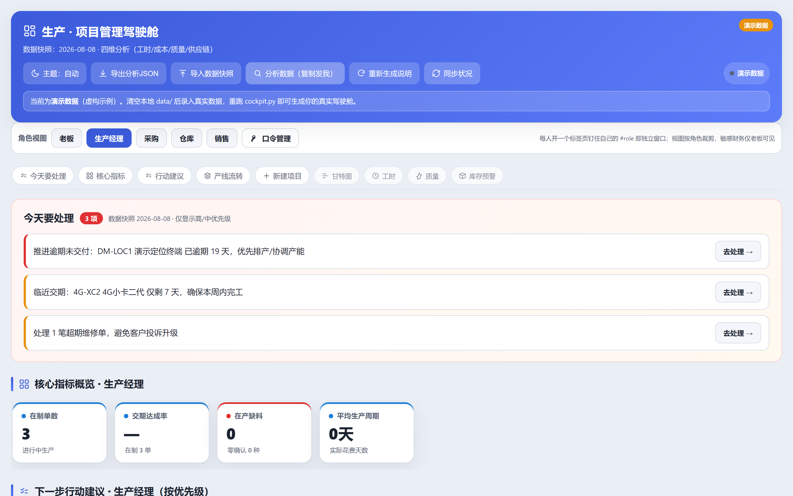
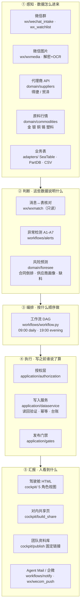

# 生产交付协同助手

[](https://github.com/Darling5/seatable-production/actions/workflows/smoke.yml)
[](LICENSE)
[](https://www.python.org/)
[](SKILL.md)

**用大白话说：这是生产经理的第二大脑。**

你在对话里说「帮我建个生产计划，4G 小卡 100 台，交期 30 天」，它在确认后落库并生成分角色驾驶舱；把采购合同丢给它，它自动匹配标准 BOM、核对库存，经你审核后生成可发供应商的正式采购订单；微信群里的交期变更、涨价通知、付款回执，它自己听、自己记、自己找人核对。

**一句话记住它的底线：`预览 → 授权 → 执行`。任何写库动作，你没点头就一步都不会走。**

业务台账不需要 SeaTable 账号，下载后即可用本地 CSV；采购库存可选一键部署的 PartDB，也可接客户已有的 ERP（API / MCP / Excel 导出）。



<sub>↑ 生产经理视角首屏实拍，数据为**虚构演示数据**。首屏只放 3-4 块：「今天要处理」置顶 → 4 张核心指标 → 行动建议，其余分析收在「更多分析」里。</sub>

**想直接点开玩玩？** → **[交互式使用指南（在线，无需安装）](https://darling5.github.io/seatable-production/usage-guide.html)**

---

## 目录

- [1. 它是什么](#1-它是什么)
- [2. 能力地图](#2-能力地图)
- [3. v2.0 断代：可信执行层](#3-v20-断代可信执行层)
- [4. 快速开始](#4-快速开始)
- [5. 日常怎么跑](#5-日常怎么跑)
- [6. 目录结构](#6-目录结构)
- [7. 场景详解](#7-场景详解)
- [8. 为什么跑在 WorkBuddy 上](#8-为什么跑在-workbuddy-上)
- [9. 深入阅读](#9-深入阅读)
- [10. 分享与安全](#10-分享与安全)
- [11. 版本与许可](#11-版本与许可)

---

## 1. 它是什么

小批量电子制造的活儿，数据散在一堆地方：项目在 SeaTable、物料在 PartDB、发货记录在某个 Excel 里、真正的变更发生在微信群里。每个人都在问别人「那个单子到哪一步了」。

这个项目把这条链路收口成三件事：

1. **一张统一的嘴** —— 所有读写走 `domain/op.py`，不管后端是本地 CSV 还是 SeaTable 云；
2. **一双自己找上门的耳朵** —— 微信监控群、行情接口、异常规则，数据主动来找你，不用你盯；
3. **一个不肯自作主张的手** —— 算法只负责「提出」，人手负责「批准」，见 [§3](#3-v20-断代可信执行层)。

### 你说一句话，它做完剩下的事

| 你说 | 它做 | 你还要做什么 |
|---|---|---|
| 生成演示版驾驶舱 | 用内置示例数据出一张完整网页 | 点开看 |
| 帮我建个生产计划：4G 小卡，100 台，交期 30 天 | 整理成待写入数据 → 摊开给你看 | **点头**，它才落库 |
| 这批货缺什么料 | 拉 BOM 比库存，列出缺料清单 | 决定下不下单 |
| 出一张发货清单 | 生成清单并可导出 Excel | — |
| 这份采购合同帮我下个单 | 解析合同 → 扩 BOM → 核库存 → 分供应商 | **审核后**才出正式订单 |
| 现在卡在哪 | 跑异常检测 + 风险预测，给出「必须立刻做」清单 | 照着做 |
| 客户上周那笔款到了没 | 群消息 ↔ 业务表逐条对账，抓「群里说了表里没有」 | 确认后写库 |

> ⚠️ **写入前一定先问你**：任何增删改都会把待写入数据**完整摊开**，你点头才落库。网页上的「一键发起」也只是拉起 WorkBuddy 并预填任务，**不会自动写库**。这是刻意设计，不是 bug。

---

## 2. 能力地图


```mermaid
flowchart TB
    subgraph S1["① 感知 · 数据怎么进来"]
        WX["微信群<br/>wx/wechat_intake · wx_watchlist"]
        IMG["微信图片<br/>wx/wxmedia · 解密+OCR"]
        API["代理商 API<br/>domain/suppliers<br/>得捷 / 贸泽"]
        RAW["原料行情<br/>domain/commodities<br/>金 银 铜 锡 塑料"]
        TAB["业务表<br/>adapters/ SeaTable · PartDB · CSV"]
    end

    subgraph S2["② 判断 · 这些数据说明什么"]
        MATCH["消息↔表核对<br/>wx/wxmatch（只读）"]
        ALERT["异常检测 A1-A7<br/>workflows/alerts"]
        FORE["风险预测<br/>domain/foresee<br/>合同倒排 · 供应商画像 · 缺料"]
    end

    subgraph S3["③ 编排 · 按什么顺序做"]
        WF["工作流 DAG<br/>workflows/workflow.py<br/>09:00 daily · 19:00 evening"]
    end

    subgraph S4["④ 执行 · 写之前谁说了算"]
        AUTH["授权层<br/>application/authorization"]
        DS["写入服务<br/>application/dataservice<br/>读回验证 · 幂等 · 台账"]
        GATE["发布门禁<br/>application/gates"]
    end

    subgraph S5["⑤ 汇报 · 人看到什么"]
        CK["驾驶舱 HTML<br/>cockpit/ 5 角色视图"]
        SHARE["对内共享页<br/>cockpit/build_share"]
        PUB["团队资料库<br/>cockpit/publish 固定链接"]
        MAIL["Agent Mail / 企微<br/>workflows/notify · wx/wecom_push"]
    end

    S1 --> S2 --> S3 --> S4 --> S5
```

**八个功能域，各自解决一个具体问题：**

| 域 | 解决什么 | 主要入口 |
|---|---|---|
| **统一读写** | 18 张业务表 + 4 张控制平面表，后端可换 | `domain/op.py` |
| **驾驶舱** | 按角色出单文件 HTML，5 套视图 + 口令分享 | `cockpit/cockpit.py` |
| **微信情报** | 群消息 → 待确认事件 → `production` / `tasks` 双 Base 分流 | `wx/wechat_intake.py` |
| **消息核对** | 群里说的 vs 表里记的，逐条对账抓缺口 | `wx/wxmatch.py` |
| **行情监控** | 元器件价格快照 + 上游原料走势 + 停产预警 | `domain/market.py` |
| **风险预测** | 合同倒排、供应商交期画像、缺料在途判断 | `domain/foresee.py` |
| **采购闭环** | 合同 → BOM 扩量 → 库存审核 → 正式采购订单 | `pipeline/` |
| **决策辅助** | 二期「项目第二大脑」+ 三期「排程与方案比较」 | `project_brain.py` · `decision_support.py` |

---

## 3. v2.0 断代：可信执行层

> 这是 v2.0 与前几个版本最大的区别，也是这个项目最值得看的设计。

### 为什么非得改

旧链路里有一条**绕过所有人**的写库通道：`wxmatch apply` 把「高置信」直接当成写入许可 —— 匹配算法一命中就改真实业务表，而且连读回验证都没有。旧注释以为「列名写错会抛异常」，但 SeaTable 实际是 **HTTP 200 + 静默丢列**。

**算法自评不能代替人的决定。** v2.0 把这两件事彻底拆开：

| 概念 | 回答的问题 | 谁说了算 |
|---|---|---|
| 置信度 | 「这条消息像不像真的」 | 匹配算法（自评） |
| **授权** | 「人同意这次写入吗」 | **人**（授权文件 / 已通过的审批） |

`application/authorization.py` **刻意不接收任何置信度字段** —— 高/中/低一视同仁。没有 `WriteGrant`，`apply` 模式直接 `blocked`。

### 副作用分级：每一步都必须自己声明

工作流里每个步骤都要标注副作用等级，执行器据此裁决闸门（`application/contracts.py`）：

| 等级 | 含义 | preview | apply |
|---|---|---|---|
| `read_only` | 只读，如 lookup、foresee --json | ✅ | ✅ |
| `local_append` | 写本地快照/台账（可重放可清理） | ✅ | ✅ |
| `online_write` | 写 SeaTable / CRM / PartDB | ⛔ 拦截 | ✅（production/tasks 仍需授权） |
| `destructive` | 删文件、清证据 | ⛔ | ⛔ 永远额外要求显式 `--yes` |
| `publish` | 对外发驾驶舱 / 稳定链接 | ⛔ | ✅（且须过发布门禁） |

### 发布门禁：账本里没证明过的，不许发出去

驾驶舱是一次**信息释放** —— 发出去就有人按它做决定。所以 `tools` 在发布前回看这次运行的账本（`data/runs/<run_id>/final.json`）：

1. 整次运行不能有 `failed` 步骤；
2. `wechat_collect` / `wxmedia_ocr` / `wxmatch_scan` / `evening_write` 这几个**关键阶段**不能 failed 或 blocked；
3. 关键阶段若报出 `verify_failed` 计数，视为关键失败 —— 那意味着「以为写进去了，其实没写」，看板和真实数据已经脱节。

`skipped` **不算失败**：没微信消息、OCR 环境缺失、当晚没给授权，本来就是正常状态，不该连坐发布。

```bash
python workflows/workflow.py verify <run_id>    # 步骤状态 + 产物新鲜度 + 安全检查
python workflows/workflow.py gate <run_id>      # 判定这次运行是否允许对外发布
```

设计契约全文见 [`docs/trusted-execution-v1.md`](docs/trusted-execution-v1.md)，整体架构依据 [`docs/avatar-loop-v2.md`](docs/avatar-loop-v2.md)。

---

## 4. 快速开始

### 4.1 装

在 WorkBuddy 里 **「我的项目 → 新建项目」**，项目来源粘贴：

```
https://github.com/Darling5/seatable-production
```

创建后会自动带上 `seatable-production` 技能和「生产驾驶舱」专家。想手装见下方折叠块。

<details>
<summary>其他安装方式（clone / ZIP）</summary>

```bash
# clone 到技能目录，可随 git 更新
git clone https://github.com/Darling5/seatable-production.git \
  ~/.workbuddy/skills/seatable-production        # Windows Git Bash 用 "$HOME/..."
```

或在 GitHub 点 `Code → Download ZIP`，解压后把 `seatable-production/` 放进 `~/.workbuddy/skills/`。

装好后**重启 WorkBuddy**。想跑引导式配置向导：

```bash
cd ~/.workbuddy/skills/seatable-production
python tools/setup.py            # 交互式：选 本地 / SeaTable
python tools/setup.py --local    # 或直接零配置
```
</details>

### 4.2 一键全自动部署

`tools/setup.py` 只负责写配置；**`tools/deploy.py` 把剩下的活全部干完**：装依赖 → 生成/更新配置 → 连通验证 → 拉云端数据 → 物料清单 → 驾驶舱 → 体检 → 部署报告。幂等可重跑，已有配置做「外科手术式」更新（口令、微信、行情段原样保留）。

**你需要做的只有一件事：把资料给到下面任意一层。**

| 资料给到哪层 | 命令 |
|---|---|
| 命令行参数 | `python tools/deploy.py --seatable-token XXX --seatable-uuid YYY --partdb-url http://... --partdb-token K` |
| 环境变量 | `export SEATABLE_TOKEN=... SEATABLE_UUID=...` 后跑 `python tools/deploy.py --yes` |
| 资料文件（推荐） | 复制 `deploy.yaml.example` 为 `deploy.yaml` 填好 → `python tools/deploy.py --profile deploy.yaml` |
| 什么都不给 | 终端可交互则逐项问答；加 `--yes` 走本地模式 |
| 零资料演示 | `python tools/deploy.py --demo`（60 秒全链路跑通，不需要任何账号） |

```text
步骤    名称              结果
----------------------------------------------
S1    环境检测            [OK]  完成   Python 3.13.14
S2    依赖自装            [OK]  完成   已安装 requests, pyyaml
S3    生成 config.yaml  [OK]  完成   全新生成配置，backend=seatable
S4    连通验证            [OK]  完成   SeaTable ✓；PartDB ✓（HTTP 200）
S5    数据初始化           [OK]  完成   云端业务表已同步到本地 data/；物料监控清单已生成
S6    驾驶舱生成           [OK]  完成   项目管理驾驶舱.html（145.5 KB）
S7    开局体检            [OK]  完成   体检完成（BLOCK 项才需要立即处理）
S8    部署报告            [OK]  完成   已写入 data/deploy-report.md
```

常用参数：`--dry-run` 只预览不落盘 · `--skip-deps / --skip-sync / --skip-doctor / --no-cockpit` 跳步 · `--yes` 免交互（CI 友好）。

> 🔒 `deploy.yaml` 含凭证，已被 `.gitignore` 排除；`config.yaml` 同理，两者都不会进仓库。

### 4.3 三种存储后端，按需选

**① 零配置（默认）** — 数据存 `data/` 下的 CSV，Excel 直接打开：

```bash
python domain/op.py append 生产计划 '{"生产产品":"4G小卡","数量":100,"关联项目":"演示项目A"}'
python domain/op.py list 生产计划
python domain/op.py export-excel 生产数据.xlsx
python cockpit/cockpit.py                      # 生成驾驶舱网页
```

**② 接你自己的业务底座** — `cp config.yaml.example config.yaml`，改一行 `backend` 即可：

```yaml
backend: seatable       # 已登记 6 个后端，见 adapters/factory.py::list_backends()
seatable:
  api_token: "你的Token"
  base_uuid: "你的BaseUUID"
```

| `backend` | 是什么 | 协议事实来源 |
|---|---|---|
| `local` | 本地 CSV/Excel（**默认，零配置**） | — |
| `seatable` | SeaTable 云 / 私有部署 | 实测 |
| `feishu` | 飞书**多维表格**（Base / Bitable） | 4 轮只读探测，全部实测 |
| `feishu_task` | 飞书**任务**（Task / 待办）—— 表=任务清单、行=任务 | 4 轮读写探测，全部实测 |
| `jiandaoyun` | 简道云 API v5 | ⚠️ **仅官方文档，无实测环境** |
| `zentao` | 禅道 REST v2（PM 实体） | 2 轮全量探测（88 路径矩阵） |

> ⚠️ **飞书是两个后端，不是一个**：`feishu` 是**多维表格**，`feishu_task` 是**任务**。
> 两者没有共同的表概念与 id 空间，连「写一个字段」的语义都不同
> （Base 是整条 record 覆盖，Task 是 `update_fields` 白名单）。
> `feishu_task` **不需要任何配置键**，凭据复用 `lark-cli` 的登录态。

命令一行都不用改。想退回本地，`backend` 改回 `local`（未登记的后端名不会静默退回，
写入路径直接抛错）。

**③ 采购库存源：按客户现状选一种**：

```yaml
inventory:
  source: partdb      # 也可选 api / mcp / file
partdb:
  enabled: true
  url: "http://你的PartDB:端口/api"
  token: "你的PartDBToken"
```

- 没有 ERP：可部署 PartDB，使用 `partdb`；
- 已有金蝶、简道云、禅道或自建 ERP：优先 `api` 或 `mcp`，通过配置完成鉴权、分页与字段映射；
- 暂时无法在线连接：`file` 读 Excel/CSV 导出。

完整配置见 [`config.yaml.example`](config.yaml.example)。**所有通用库存默认属于「未确认库存」，必须经过人工库存审核才可抵扣生产需求。**

---

## 5. 日常怎么跑

数据链路由代码执行，不再靠 Prompt 记 13 步。一天两班：

### 09:00 轻同步（`daily`）

补增量、不重建、不发布 —— 醒来先知道今天要管什么。

| # | 步骤 | 做什么 |
|---|---|---|
| 1 | `seatable_sync` | 同步生产业务 Base |
| 2 | `partdb_sync` | 同步 PartDB 库存 |
| 3 | `wechat_pull` | 微信事件增量拉取 |
| 4 | `wechat_summary` | 微信 24h 摘要取数 |
| 5 | `wxmatch_scan` | 消息↔业务表核对（只读） |
| 6 | `alerts` | 异常检测 A1-A7 |
| 7 | `foresee` / `foresee_review` | 风险预测重算 + 台账复盘 |
| 8 | `loop_sync` | 业务闭环台账镜像 CRM |
| 9 | `daily_brief` | 站会摘要 + 写发件箱 |
| 10 | `cockpit` | 驾驶舱重新生成 |

### 19:00 全量重扫（`evening`）

采集 → OCR → 核对 → **授权写入** → 快照 → 风险 → 生成发布，末步过发布门禁。

| # | 步骤 | 做什么 | 失败策略 |
|---|---|---|---|
| 1 | `wechat_collect` | 微信消息采集（增量） | abort |
| 2 | `wxmedia_ocr` | 微信图片解密 + OCR 提取 | continue |
| 3 | `wxmatch_scan` | 消息↔业务表核对（只读） | abort |
| 4 | `evening_write` | **授权写入及读回**（无授权则跳过） | abort |
| 5 | `seatable_snap` / `partdb_snap` | 业务表 + 库存快照 | abort / continue |
| 6 | `alerts` / `foresee` / `foresee_review` | 异常 + 风险 + 复盘 | continue |
| 7 | `cockpit` | 驾驶舱重新生成 | continue |
| 8 | `publish` | 发布到团队资料库（**带发布门禁**） | continue |

```bash
python workflows/workflow.py run daily --mode preview    # 演练：online_write 全被拦截
python workflows/workflow.py run evening --mode apply    # 真实执行
python workflows/workflow.py run daily --resume <run_id> # 断点续跑（成功步骤跳过）
python workflows/workflow.py status <run_id>             # 查看历史运行
python workflows/workflow.py list                        # 列出历史运行
```

运行结果落 `data/runs/<run_id>/final.json` —— AI 播报与人工核对**只读这个文件**。

### 发布到团队资料库

本地生成是给构建用的，**分发**走 WorkBuddy 团队资料库：固定链接、服务端权限，每日覆盖更新自动留版本历史。

```bash
python cockpit/publish.py --setup --space-id <空间ID> --token-stdin   # 首次发布，node_id 回写 config.yaml
python cockpit/publish.py --token-stdin                                # 之后每天覆盖更新，链接不变
python cockpit/publish.py --status                                     # 查看当前发布目标
```

- token 由 AI 调 `connect_open_platform`（skill_id=library）取得，经 stdin 传入，**不落盘**；
- 发布目标存 `config.yaml` 的 `publish` 段，已 gitignore；
- 发布失败保留本地 HTML 兜底，退出码 2 可被自动化识别为「仅发布失败」。

> 混合架构建议：**生成在本地**（凭证与数据源都在本机，快、可离线重跑），**分发在库内**（一个 URL 永远最新）。不要砍掉本地生成环节。

---

## 6. 目录结构

2026-09-26 起按功能域归组 —— 根目录只留两个总入口与配置样例：

```
seatable-production/
├── SKILL.md / README.md        技能定义 / 本说明
├── project_brain.py            二期「单项目第二大脑」总入口
├── decision_support.py         三期「项目决策辅助」总入口
├── config.yaml.example         配置模板（复制为 config.yaml 后填写）
│
├── application/                ★ 可信执行层（纯逻辑，可离线单测）
│   ├── contracts.py               副作用分级 / 写入策略 / 步骤终态
│   ├── authorization.py           写库授权闸门（刻意不接收置信度）
│   ├── dataservice.py             统一写入 + 读回验证 + 幂等 + 台账
│   ├── gates.py                   发布门禁
│   ├── runner.py                  DAG 执行器（拓扑排序 / resume）
│   ├── project_brain/             二期内核（上下文 / 行动 / 证据 / 记忆）
│   └── decision_support/          三期内核（排程 / 图 / 方案 / 复盘）
│
├── adapters/                   存储适配层
│   ├── base.py                    三层契约（必修方法 / 能力声明 / 可选方法）+ 12 个能力位
│   ├── factory.py                 后端注册表（register_backend）+ fail-closed 路由
│   ├── schema.py                  跨后端逻辑 schema + 中立类型词表
│   └── local.py / seatable.py / partdb.py    具体后端实现
├── domain/                     业务域
│   ├── op.py                      统一读写 CLI（模型与用户都只调它）
│   ├── market.py / suppliers.py / commodities.py    行情三件套
│   ├── foresee.py                 风险预测引擎
│   ├── order_to_cash.py           12 类业务对象闭环控制平面
│   ├── won_deal.py / crm_dispatch.py / intake.py    赢单 · CRM 录入 · 意图分级
│   └── evidence.py                图片证据元数据 + 季度清理候选
├── workflows/                  编排：workflow · daily_refresh · evening_full ·
│                               alerts · daily_brief · business_loop · loop_sync · notify
├── cockpit/                    驾驶舱：cockpit · server · autostart · build_share · publish
├── wx/                         微信域：wechat_intake · wxmatch · wxwatch · wxmedia ·
│                               wx_watchlist · wa_db · wecom_push · wx_dispatch
├── sync/                       seatable_sync · partdb_sync · backfill_seatable · sync_expert
├── tools/                      deploy · setup · doctor · passwords · seed_demo · audit_wx_coverage
├── automations/                WorkBuddy 自动化桥（bridge/ + prompt 模板）
├── pipeline/                   采购初始化管道：合同 → BOM → 库存审核 → 采购订单
├── tests/                      466 项离线回归测试（不碰线上数据）
├── docs/                       手册 · 契约 · 配图 · 在线指南（GitHub Pages 源）
├── references/                 长文档：changelog · analysis · wx-intake-and-check · …
├── expert/                     专家包（production-cockpit）
├── partdb-part-create/         捆绑子技能：PartDB 建料
├── partdb-price-import/        捆绑子技能：PartDB 价格导入
└── feishu-paytable-reconcile/  捆绑子技能：飞书薪资表对账
```

运行方式由 `python op.py` 变为 `python domain/op.py`，其余同理 —— 所有文档内引用已同步。

---

## 7. 场景详解

<details>
<summary><b>7.1 微信情报 · 群消息变成业务事实</b></summary>

**双引擎只读本地微信数据库，不连微信服务器。**

```text
微信 4.x：wx/wa_db.py 直读本地加密库（主密钥从进程内存提取）
微信 3.x：win-wechat-summary 生成 merge_all.db（回退路径）
        ↓ 只读
wx/wechat_intake.py pull（引擎A优先，自动回退引擎B）
        ↓
微信事件.csv（待确认）→ AI 分流，同一消息可拆两条
production：业务事实候选 / tasks：负责人·截止日期·追问候选
        ↓ 分别展示目标 Base/表/字段，用户确认后才写入
```

```bash
python wx/wechat_intake.py doctor      # 数据库体检（19 个，已解密 19 个）
python wx/wechat_intake.py groups      # 列出全部群（名称+群ID，缓存 groups.json）
python wx/wechat_intake.py pull        # 按 bookmark 增量拉取
python wx/wechat_intake.py list --status 待确认
python wx/wechat_intake.py approve WX20260821-001
```

可识别分类：交期变更、价格变动、停产通知、催货、进度、库存、其他。

**挑监控群不要拍脑袋**。一个微信群列表动辄几百个，按四类勾（以实际 380 群筛 31 群为例）：

| 类别 | 挑什么 | 价值 |
|---|---|---|
| 生产/组装/贴片 | 贴片厂、组装厂、灌胶加工群 | 工序进度、送料返料 |
| IC/物料/供应商 | 芯片代理、外壳模具、电机群 | 价格变动、停产、交期 |
| 客户/项目 | 甲方项目群、商务群 | 催货、付款、需求变更 |
| 内部 | 公司内部生产群 | 决策、跨部门协调 |

群名原样写进 `watch_groups` 即可（含空格、`&`、全角括号都没问题），支持精确 / 群ID / 子串三种匹配。

**供应商群自动纳入**（`wx/wx_watchlist.py`）：从 SeaTable 供应商/客户实体自动生成归一化关键词（三层剥离城市前缀 → 公司后缀 → 行业通用词），并进 `watch_groups`。**以后群名带上供应商名就自动进监控**，无需手改配置。

> ⚠️ **依赖装在哪个 venv 就用哪个 venv 跑**。缺 `cryptography` 时报「微信4.x未登录 / 版本不支持」是**误导项**——真正原因几乎总是当前解释器缺包：
> ```bash
> .venv-pipeline/Scripts/python.exe -m pip install cryptography pyyaml
> ```
> 自检通过的标准输出是 `数据库：19 个，已解密 19 个`，而不是任何 `[!]`。
>
> ⚠️ **微信 4.x 用户不要用 win-wechat-summary 类工具**：它们靠 `psutil` 精确匹配进程名 `WeChat.exe`，而 4.x 主程序已改名 `Weixin.exe`，必然报「未检测到微信进程」；其内置 PyWxDump 偏移表也只支持到 3.9.12.55。引擎A 直读 4.x `db_storage` 是唯一可行路径。

</details>

<details>
<summary><b>7.2 微信图片解密 + OCR（v1.9.0，推翻了旧结论）</b></summary>

旧文档写「图片拿不到字节、付款截图无法 OCR」—— **该结论作废**。根因是旧排查**看错了路径层级**（把 `xwechat_files` 父目录当账号目录）。

实测：`msg/attach/<md5(会话username)>/<YYYY-MM>/Img/` 下 **57,606 个 `.dat`、9.4 GB**，2026-09 单月 3,847 张。

**三种加密格式**（按文件头区分）：

| 格式 | 魔数 | 密钥 |
|---|---|---|
| V0 / 旧 XOR | 无魔数 | 整文件单字节 XOR |
| V1 | `07 08 56 31 08 07` | 固定 AES key `cfcd208495d565ef` |
| V2（主流） | `07 08 56 32 08 07` | **离线派生** |

**V2 密钥离线派生**（无需扫进程内存）：`aes_key = md5(f"{code}{wxid}").hexdigest()[:16]`，取前 16 个 ASCII 字符直接当 16 字节密钥（**不是** hex 解码 —— 这是最容易猜错的一步）。结构自检用总长恒等式 `file_size == 15 + aes_size + 16 + xor_size`，比猜魔数靠得住。

`wxgf` 是微信自研封装（非 JPEG），需调安装目录 `VoipEngine.dll` 的 `wxam_dec_wxam2pic_5` 转码。

```bash
python wx/wxmedia.py doctor                          # 自检：数据根 / 账号 / 密钥 / 抽样解密
python wx/wxmedia.py key                             # 打印派生密钥
python wx/wxmedia.py scan --hours 72 --max 10 --ocr  # 解密 + OCR
```

端到端实测：扫 122 会话 / 解密 80 张 / 命中业务关键词 18 张，其中读出一张建行电子回执全文（付款人、收款人、金额、用途、交易状态）。

> OCR 引擎 `rapidocr_onnxruntime`：`C:\Python311` 有、managed 3.13 缺 → 跑微信图片命令一律用 `C:\Python311\python.exe`。

</details>

<details>
<summary><b>7.3 实时哨兵 · 异常检测 · 站会摘要（第二大脑三件套）</b></summary>

数据不再等你看，而是主动找你：

```bash
# 🌉 耳朵：实时监听（1 秒轮询，监控群命中关键词自动登记事件 + 写通知发件箱）
python wx/wxwatch.py watch              # 常驻监听（微信保持登录）
python wx/wxwatch.py once --minutes 60  # 低频模式：扫描过去 N 分钟
python wx/wxwatch.py status             # 哨兵状态 / 最近命中

# 🧠 神经：异常检测
python workflows/alerts.py run          # 跑全部规则 → data/alerts.json
python workflows/alerts.py show

# 📋 嘴巴：站会摘要（异常 + 微信情报 + 业务面合成一段话）
python workflows/daily_brief.py --push  # 生成 data/daily_brief.md 并写发件箱

# 📬 发件箱（进程解耦：生产者只管写，AI 会话经 agent-mail 发送）
python workflows/notify.py dump                # 取未发送通知
python workflows/notify.py mark-sent --ids 1,2
```

关键词分两级：**高危**（交期/延期/涨价/停产/缺料/催货，命中即通知）和**一般**（价格/库存/到货/进度，仅登记事件）。

**异常规则一览**：A1 交期逼近（≤7 天未完货）· A2 项目已超期 · A3 逾期应收 · A4 采购在途逐条 · A5 计划停滞（超 2 周无推进）· A6 行情异动（±10%）与 NRND/EOL · A7 数据体检（空状态 / `#VALUE!` 脏值）。

</details>

<details>
<summary><b>7.4 消息 ↔ 业务表核对（只读对账）</b></summary>

微信情报解决「群里说了什么」，核对引擎解决「**群里说的和表里记的对不对得上**」。

```bash
python wx/wxmatch.py scan                # 扫描监控群 + 微信收到的合同 PDF，写核对台账
python wx/wxmatch.py list                # 查看待核对项
python wx/wxmatch.py done WX-M-...001    # 处置留痕
python wx/wxmatch.py intent              # 导出高置信项预填意图（确认后走 approve 写库）
```

| 核对类型 | 群里看到的 | 对哪张表 | 匹配规则 |
|---|---|---|---|
| 收款 | 「已打款 xx 万」「到账了」 | 项目表「待收」 | 金额 ±2% 容差 → 高置信 |
| 下单 | 「下单」「返单」 | 项目表客户名 | 匹配不到 → 提示可能漏立项 |
| 客户合同 | 合同 PDF | 项目表「合同」列 | 客户名 + 产品词双维度 |
| 供应商合同 | 采购合同 PDF | 5 张采购记录表 | 供应商名归一（含一字之差别名），金额差 >5% 警示 |

**为什么可信**：核对引擎**只读**，绝不自动写 SeaTable —— 高置信收款项只生成「预填意图」，人在驾驶舱或对话里确认后才落库。

</details>

<details>
<summary><b>7.5 物料行情监控（元器件 + 上游原料）</b></summary>

> **v1.8.3 起**：查价三件套的触发与命令卡已拆至独立子技能 **price-sensor**。脚本与数据仍在本目录**单份维护**，子技能只是薄指针，不要复制脚本过去。

```bash
python domain/market.py watchlist               # 从采购记录生成监控清单
python domain/market.py snapshot --model FR8018HD --price 3.50 \
  --channel 立创商城 --lifecycle 在产 --source "https://example.com/source"
python domain/market.py report
python domain/market.py alerts
```

默认阈值 `market.alert_threshold: 10`：最新价相对上次采购价 ±10%、快照环比 ±10%、`NRND` / `EOL停产` 立即预警。

**代理商 API 自动查价**（`domain/suppliers.py`，抹平得捷与贸泽差异并统一折算人民币）：

```bash
python domain/suppliers.py doctor         # 凭证自检（值脱敏）
python domain/suppliers.py doctor --live  # 真实联网探测一次
python domain/market.py lookup FR8018HD   # 单型号查价，只查不写
python domain/market.py compare FR8018HD  # 多源比价，标出最低/最高/差价
python domain/market.py sync --dry-run    # 预览这轮将查哪些
python domain/market.py sync --limit 5    # 省配额调试
```

**自适应复查节奏**（省配额的核心，按库存电子料数量自动选）：

| 库存电子料数量 | 复查间隔 | 依据 |
|---|---|---|
| ≤ 100 种 | 每 7 天 | 料少，盯紧点 |
| 101 ~ 300 种 | 每 15 天 | 折中 |
| > 300 种 | 每 30 天 | 料多，配额优先 |

**三道省配额闸门**：① 本地预筛（`P1`、`Z3.5`、`26MHz/0.5ppm` 这类内部料号与规格描述**不是制造商型号**，永远查不到）→ 拦下 28%；② 未知缓存（近 30 天已确认查无此型号）→ 拦下 17 个；③ 节奏到期。实测 25 个型号第二轮**只剩 1 个真正发请求**。

> ⚠️ **先看清适用性，别指望它管全部料**：得捷/贸泽是**欧美代理商**，对国产料和定制料号基本零覆盖。实测本仓库 25 个启用型号（FR8018HD、ML307N、OM6626B 等国产芯片为主），贸泽**有效命中 0 条**。
> 这两个 API 的正确用法是**选型阶段查新料号**，而不是给国产 BOM 做行情巡检 —— 后者仍以人工录入和立创商城为主。

**四条铁律**（改代码前先读 `domain/suppliers.py` 文件头）：

1. **只读** —— 只调查询接口，绝不碰下单/报价/购物车；
2. **凭证不落库** —— 只从本地 `config.yaml` 读，日志与报错一律脱敏；
3. **失败降级** —— 超时/鉴权失败/查无此料都返回 `ok=False`，**不抛异常**；
4. **统一人民币** —— 返回原币种 + `price_cny`，汇率走免费接口，拿不到就退回静态值并标注来源。

**上游原料行情**（`domain/commodities.py`）：锡价决定 SMT 焊料成本，铜价决定 PCB 与线材，金银决定镀层键合线，ABS/PC/PS 决定外壳。

```bash
python domain/market.py raw list                    # 有哪些品种、各自数据源
python domain/market.py raw fetch                   # 拉实时价并写库（每天一次积累走势）
python domain/market.py raw show --days 30          # 走势表（sparkline + 区间涨跌）
python domain/market.py raw trend --days 30         # 波动超阈值告警（默认 ±3%）
python domain/market.py raw backfill AU --contract au2612 --days 60   # 补历史
```

| 品种 | 数据源 | 说明 |
|---|---|---|
| 黄金 / 白银 / 铜 / **锡** / 铝 / 镍 | 新浪期货连续合约（实时） | 免费、无需申请、无 API key |
| PP / LLDPE / PVC | 新浪期货连续合约 | 塑料的**上游石化链代理指标** |
| ABS / PC / PS 树脂 | **人工录入** | 现货，无公开免费 API |

**关于塑料的诚实说明**：ABS/PC/PS 是石化下游**现货**品种，报价被生意社、卓创、中塑在线等资讯商垄断（付费），**没有公开的免费 API**。所以做法是：金属全自动；PP/LLDPE/PVC 作上游代理指标提前感知拐点；ABS/PC/PS 人工录入你的采购报价积累走势。若日后接入付费源（如同花顺 iFinD 有化工品现货库），只需加一个 source 适配器，**CSV 结构与展示层都不用动**。

> **口径隔离**：补录的具体合约（如 `au2612`）与日常的「连续」是两个口径，写进 CSV 的「口径」列，**环比只跟同口径比** —— 拼接不同口径会出现假涨跌（与元器件的「串渠道假涨跌」是同一类坑）。新浪日 K 线服务已下线，历史补录改走东方财富。

</details>

<details>
<summary><b>7.6 采购闭环：合同 → 采购订单</b></summary>

一份采购合同进来，走到可发供应商的正式订单：

```bash
python pipeline/run.py init      # 客户 BOM 与流程文件放入 pipeline/customer/，填写 rules.local.yaml
```

链路：**合同解析 → 标准 BOM 扩量 → 库存源查料（PartDB / API / MCP / Excel）→ 人工库存审核 → 供应商分组 → 正式采购订单 PDF**。

库存适配器在 `pipeline/inventory_sources.py`，公共采购规则模板在 `pipeline/rules.yaml`（不含任何客户信息）。**所有通用库存默认属于「未确认库存」，必须经人工审核才可抵扣生产需求。**

</details>

<details>
<summary><b>7.7 二期：单项目第二大脑（project_brain.py）</b></summary>

把单个项目从「一堆记录」变成「有 ID、有状态、有证据、有下一步」的活体。设计原则与一期一致：**先预演，再授权，才执行**。

```bash
# 0) 造一份授权（人亲手做的一步）
python project_brain.py grant --actor 老板 --hours 8 --out data/approvals/GRT-demo.json

# 1) 预演：不写任何东西
python project_brain.py ingest --file docs/contracts/examples/project-brain-sample.json
python project_brain.py context --project-id PRJ-20260926-0001

# 2) 真实写入：必须带授权
python project_brain.py ingest --file ... --mode apply --grant-file data/approvals/GRT-demo.json

# 3) 查询五问
python project_brain.py query --project-id PRJ-... --question today
```

**不带 `--mode apply` 一律是 preview**：所有写入退化成 candidate，一行都不落盘。

子命令：`context`（统一上下文）· `snapshot`（固化快照）· `actions` / `transition` / `close`（行动生命周期，**关闭必须带验收证据**）· `rollover`（跨天滚动保留原期限）· `reminders` · `evidence` · `verify-observation`（观察升格为已核实事实）· `correct`（追加纠正，**不覆盖历史**）· `replay`（离线验收）。

契约见 [`docs/contracts/project-brain-v1.md`](docs/contracts/project-brain-v1.md)。

</details>

<details>
<summary><b>7.8 三期：项目决策辅助（decision_support.py）</b></summary>

**只读、离线。** 四条命令对应四个问题：

```bash
python decision_support.py analyze --snapshot <file>              # 这活什么时候完？卡在哪？
python decision_support.py compare --snapshot <file>              # 换个条件能不能好一点？要谁点头？
python decision_support.py delay   --snapshot <file> --step <id> --hours 8   # A 晚 8 小时会连累谁？
python decision_support.py explain --snapshot <file> --step <id>  # 凭什么算成这天？
python decision_support.py backtest --records <file>              # 以前预测准不准？
python decision_support.py align                                  # 二期/三期契约对得上吗？
python decision_support.py demo                                   # 内置合成样例跑全链路
```

- `analyze` 出三日期 + 关键路径 + 资源可行排程；
- `compare` 比较方案（S0 基准 / S1 提前到货 / S2 加设备），明确列出「执行意图（**未授权、未执行**）」；
- `backtest` 带**防未来信息审计**，避免用事后信息污染预测；
- 所有命令都不写任何业务表；退出码 0 正常 / 1 输入错误 / 2 排程不可用。

契约见 [`docs/contracts/decision-support-v1.md`](docs/contracts/decision-support-v1.md)，两期对齐见 [`docs/contracts/alignment-p2-p3-v1.md`](docs/contracts/alignment-p2-p3-v1.md)。

</details>

<details>
<summary><b>7.9 业务闭环控制平面（12 类对象 · 离线可预演）</b></summary>

`domain/order_to_cash.py` 管理 12 类业务对象的本地控制平面（对象、状态、证据、审批），**不直接写 SeaTable** —— 正式写入仍走上层候选/审批链，这样可以先离线演练整条业务链。

对象：客户 CUS · 线索 LED · 商机 OPP · 需求 REQ · 方案 SOL · 报价 QUO · 合同 CTR · 项目 PRJ · 生产订单 MO · 采购订单 PO · 发货 SHP · 售后 AS。

```bash
python workflows/business_loop.py doctor      # 自检
python workflows/business_loop.py scenario    # 离线跑一遍完整业务链（合成数据）
python workflows/business_loop.py start / advance / revise / status   # 起步·推进·变更·查询
python workflows/business_loop.py cases --json                        # 全部在办事项
python workflows/business_loop.py report                              # 看板

python workflows/loop_sync.py                # dry-run：打印将建表/新增/更新的行数
python workflows/loop_sync.py --yes          # 实际写入 CRM Base（幂等，可重复执行）
python workflows/loop_sync.py --tables objects --yes
```

`loop_sync` 把本地四张控制平面表（objects / transitions / evidence / approvals）镜像到 CRM Base，按主键幂等 upsert，**重复运行零重复零噪音**；默认 dry-run，`--yes` 才真写云端。

</details>

---

## 8. 为什么跑在 WorkBuddy 上

这个项目完全可以在裸 Windows 上跑，但配合 WorkBuddy 用，有四个别人替代不了的点：

| # | 理由 | 具体表现 |
|---|---|---|
| 1 | **技能两级共享** | 用户级（`~/.workbuddy/skills/`，个人私有）和项目级（`<项目>/.workbuddy/skills/`，团队同版本）天然分开，一人维护、全员即时升级，版本不会漂移 |
| 2 | **团队资料库分发** | 驾驶舱 HTML 发到团队空间就是一个**固定链接**，服务端权限（owner/editor/reader），每日覆盖更新自动留版本历史 —— 同事永远打开的是最新版 |
| 3 | **定时自动化** | 「每日 9 点轻同步」「每晚 7 点全量重扫」挂在平台侧，机器开着就能跑：拉数据 → 重新生成 → 重新发布 → 推送摘要 |
| 4 | **Agent Mail 推送** | 哨兵抓到的异常、站会摘要走发件箱，由 AI 会话真正推送出去；企微群也可直接推（`wx/wecom_push.py --body-file`）—— 消息主动找你 |

---

## 9. 深入阅读

| 文档 | 内容 |
|---|---|
| 📖 [使用手册](docs/manual.md) | 18 张表怎么用、阶段 → 该写哪张表的对照、甘特图怎么读、格式铁律 |
| 🖥️ [交互式使用指南](https://darling5.github.io/seatable-production/usage-guide.html) | 能点的角色视图 / 深链发起 / 夜间模式演示 |
| 📁 [导入为项目](docs/import-as-project.md) | 团队共享同一套版本的做法 |
| 🔒 [可信执行层 v1](docs/trusted-execution-v1.md) | 授权闸门、晚间链路、发布门禁的完整设计 |
| 🧭 [替身闭环 v2 架构](docs/avatar-loop-v2.md) | 12 类业务对象、14 态状态机、v2.x 的唯一架构依据 |
| 🧠 [二期契约](docs/contracts/project-brain-v1.md) · [三期契约](docs/contracts/decision-support-v1.md) | 字段、快照、联表口径 |
| 📚 [完整版本历史](references/changelog.md) | 每个版本的设计决策与踩坑归档 |
| 📋 [变更日志](CHANGELOG.md) | 面向使用者的版本摘要 |

---

## 10. 分享与安全

公共仓库只包含通用代码、规则模板和示例配置，**不保存客户数据或凭证**。

以下内容全部在 `.gitignore` 内，CI 也会在推送时主动拦截误提交：

```
config.yaml · deploy.yaml · data/ · cockpit_passwords.json ·
pipeline/customer/ · pipeline/rules.local.yaml · pipeline/out/ · 驾驶舱 HTML
```

**驾驶舱网页里嵌的是你的真实业务数据。公开演示前必须用演示数据重新生成。**

```bash
python tools/seed_demo.py       # 用内置演示数据重建（已有数据则跳过，需先清空 data/）
python tools/passwords.py show  # 查看当前口令（仅本地 / 私聊）
```

---

## 11. 版本与许可

当前版本 **v2.0.0**（2026-09-26）。完整历史见 [CHANGELOG.md](CHANGELOG.md)。

**支持环境**：Python 3.9 – 3.13（CI 在 3.9 与 3.12 上跑全量冒烟 + 语法编译 + 敏感文件拦截）。核心链路仅依赖 `requests` 与 `pyyaml`，**零配置即可跑通**；按需追加：

| 能力 | 额外依赖 |
|---|---|
| 读 SeaTable / PartDB / 代理商 API | `requests`（已在 `requirements.txt`） |
| 微信 4.x 本地库与图片解密 | `cryptography` |
| 微信图片 OCR | `rapidocr_onnxruntime`（本机在 `C:\Python311`） |
| 生成采购订单 PDF | `reportlab` |

**测试**：**828 项**离线回归测试，不触碰线上数据。

```bash
python -m unittest discover -s tests -q
```

除离线单测外，每个真后端都有一个**真实服务端验证器**，默认只读、可安全随时跑：

```bash
python tools/verify_feishu.py      --read-only   # 飞书多维表格
python tools/verify_feishu_task.py --read-only   # 飞书任务（24 项）
python tools/verify_feishu_task.py --write-test  # 飞书任务写路径（56 项，一次性清单+自动清理）
python tools/verify_jiandaoyun.py  --read-only   # 简道云
python tools/verify_zentao.py      --read-only   # 禅道
```

> 「测试全绿」不等于「守卫有效」—— 一个从没被触发过的断言，把守卫代码退回后照样是绿的。
> 所以关键适配器还做**反向验证**：把每处守卫**逐个临时退回**，确认对应测试**真的变红**，
> 再恢复并做**字节级 md5 校验**。飞书任务 **14/14** 守卫通过。

[MIT License](LICENSE) © 2026 Darling5

---

<sub>本文档由 **混元3**（腾讯混元大模型）辅助撰写。</sub>
